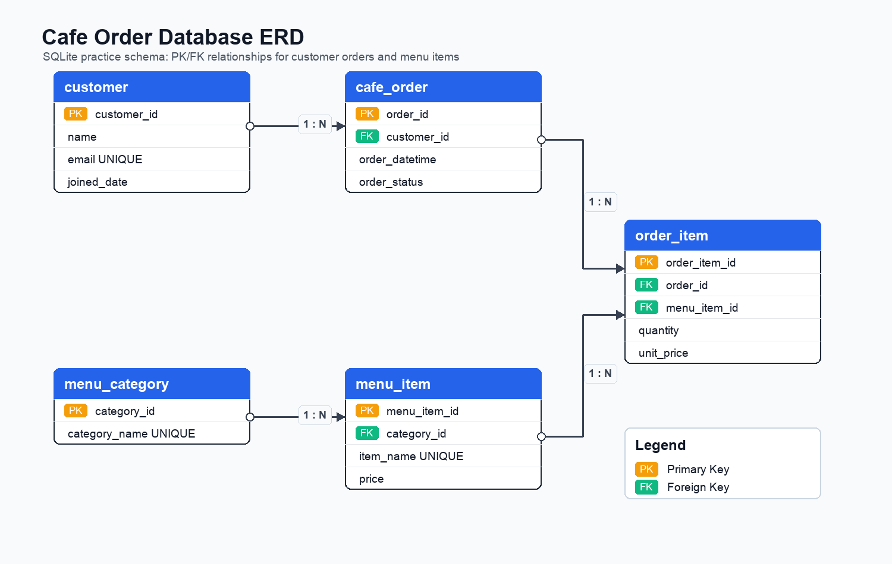

# SQLite DB 실습: 카페 주문 관리

## 주제

카페 주문 관리 데이터베이스를 SQLite로 설계했다.

고객, 메뉴, 주문, 주문상세 데이터를 테이블로 나누고 PK/FK 관계를 연결해서 `SELECT`, `JOIN`, `GROUP BY`, 서브쿼리, `UPDATE`, `DELETE`, 인덱스를 실습할 수 있도록 구성했다.

## ERD 다이어그램



## 제출 파일

| 파일 | 설명 |
| --- | --- |
| `01_schema.sql` | 테이블 생성, PK/FK/NOT NULL/UNIQUE/CHECK 제약조건 |
| `02_insert_sample_data.sql` | 샘플 데이터 입력 |
| `03_queries.sql` | 핵심 SQL 쿼리 15개 |
| `query_results/queries_result.txt` | 15개 쿼리 실행 결과 텍스트 |
| `query_results/screenshots/` | 쿼리별 실행 결과 캡처 이미지 15개 |
| `db_diagram.png` | ERD 다이어그램 이미지 |
| `cafe_order.sqlite` | SQL 실행이 반영된 SQLite DB 파일 |
| `README.md` | 상세 설명 문서 |

## 실행 방법

SQLite에 들어가서 순서대로 실행한다.

```bash
sqlite3 cafe_order.sqlite
```

```sql
.read 01_schema.sql
.read 02_insert_sample_data.sql
.read 03_queries.sql
```

`03_queries.sql`을 실행하면 각 쿼리가 아래 형식으로 출력된다.

```text
Q01. 쿼리 설명
실행 쿼리:
SELECT ...
실행 결과:
결과 테이블
```

따라서 터미널에서 실행해도 쿼리 번호, 실제 쿼리문, 실행 결과를 한 번에 확인할 수 있다.

터미널에서 한 번에 실행하려면 아래처럼 실행한다.

```bash
sqlite3 cafe_order.sqlite < outputs/01_schema.sql
sqlite3 cafe_order.sqlite < outputs/02_insert_sample_data.sql
sqlite3 cafe_order.sqlite < outputs/03_queries.sql
```

## 테이블 구성

| 테이블 | 역할 |
| --- | --- |
| `customer` | 고객 정보 저장 |
| `menu_category` | 메뉴 카테고리 저장 |
| `menu_item` | 실제 판매 메뉴 저장 |
| `cafe_order` | 주문 한 건 저장 |
| `order_item` | 주문 안에 들어간 메뉴 상세 저장 |

## 테이블 관계

| 관계 | 설명 |
| --- | --- |
| `customer(1) -> cafe_order(N)` | 고객 한 명은 여러 번 주문할 수 있다. |
| `cafe_order(1) -> order_item(N)` | 주문 한 건에는 여러 메뉴가 들어갈 수 있다. |
| `menu_category(1) -> menu_item(N)` | 카테고리 하나에는 여러 메뉴가 들어갈 수 있다. |
| `menu_item(1) -> order_item(N)` | 메뉴 하나는 여러 주문상세에 반복해서 등장할 수 있다. |

## `order_item`이 필요한 이유

주문 하나에는 여러 메뉴가 들어갈 수 있고, 메뉴 하나는 여러 주문에서 팔릴 수 있다.

즉 `cafe_order`와 `menu_item`은 실제로는 다대다 관계에 가깝다.

```text
cafe_order -> order_item -> menu_item
```

이 다대다 관계를 풀기 위해 중간에 `order_item` 테이블을 두었다. `order_item`은 단순 연결뿐 아니라 수량(`quantity`)과 주문 당시 가격(`unit_price`)도 저장하므로 주문상세 테이블이라고 볼 수 있다.

## 요구사항 반영 방식

| 요구사항 | 반영 방식 |
| --- | --- |
| 로컬 DB 사용 | SQLite 사용 |
| 최소 4개 테이블 | 5개 테이블 생성: `customer`, `menu_category`, `menu_item`, `cafe_order`, `order_item` |
| 각 테이블 PK | 모든 테이블에 `INTEGER PRIMARY KEY AUTOINCREMENT` 적용 |
| 최소 2개 이상 1:N 관계 | 총 4개 1:N 관계 구성 |
| FK 사용 | `menu_item.category_id`, `cafe_order.customer_id`, `order_item.order_id`, `order_item.menu_item_id` |
| NOT NULL | 이름, 이메일, 가입일, 가격, 주문 시간, 주문 상태 등 주요 컬럼에 적용 |
| UNIQUE | `customer.email`, `menu_category.category_name`, `menu_item.item_name` |
| CHECK | `price > 0`, `quantity > 0`, `unit_price > 0`, 주문 상태 값 제한 |
| 각 테이블 10행 이상 | 모든 테이블에 10행 이상 샘플 데이터 입력 |
| 기본 조회 4개 이상 | Q01~Q04 |
| JOIN 4개 이상 | Q05~Q08 |
| 집계 3개 이상 | Q09~Q11 |
| 서브쿼리 1개 이상 | Q12 |
| UPDATE, DELETE | Q14, Q15 |
| 인덱스 1개 이상 | Q13에서 `idx_cafe_order_order_datetime` 생성 |
| 결과 확인 자료 | `query_results/queries_result.txt`와 `query_results/screenshots/`에 저장 |
| ERD 이미지 | `db_diagram.png` 생성 및 README에 표시 |

## 평가기준표 충족 상세

### 항목 1. 필수 산출물과 SQL 요구사항 충족

#### 최소 4개 테이블이 존재하고, 각 테이블에 PK가 정의되어 있는가?

충족했다. 이 프로젝트는 최소 요구사항인 4개보다 많은 5개 테이블을 사용한다.

| 테이블 | PK 컬럼 | PK 정의 위치 |
| --- | --- | --- |
| `customer` | `customer_id` | `01_schema.sql` |
| `menu_category` | `category_id` | `01_schema.sql` |
| `menu_item` | `menu_item_id` | `01_schema.sql` |
| `cafe_order` | `order_id` | `01_schema.sql` |
| `order_item` | `order_item_id` | `01_schema.sql` |

각 테이블의 PK는 아래와 같은 형태로 정의했다.

```sql
customer_id INTEGER PRIMARY KEY AUTOINCREMENT
```

`PRIMARY KEY`는 각 행을 구분하는 고유 번호라는 뜻이다. `AUTOINCREMENT`는 데이터를 넣을 때 번호를 직접 입력하지 않아도 SQLite가 자동으로 1, 2, 3처럼 증가시키는 기능이다.

#### FK를 사용한 1:N 관계가 최소 2개 이상 존재하고, 없는 값 참조가 실제로 막히는가?

충족했다. 최소 2개가 아니라 총 4개의 1:N 관계를 만들었다.

| 1:N 관계 | FK 컬럼 | 의미 |
| --- | --- | --- |
| `customer(1) -> cafe_order(N)` | `cafe_order.customer_id` | 고객 한 명은 여러 번 주문할 수 있다. |
| `cafe_order(1) -> order_item(N)` | `order_item.order_id` | 주문 한 건에는 여러 메뉴가 들어갈 수 있다. |
| `menu_category(1) -> menu_item(N)` | `menu_item.category_id` | 카테고리 하나에는 여러 메뉴가 들어갈 수 있다. |
| `menu_item(1) -> order_item(N)` | `order_item.menu_item_id` | 메뉴 하나는 여러 주문상세에 등장할 수 있다. |

FK는 `01_schema.sql`에 아래처럼 정의되어 있다.

```sql
FOREIGN KEY (customer_id) REFERENCES customer(customer_id)
FOREIGN KEY (category_id) REFERENCES menu_category(category_id)
FOREIGN KEY (order_id) REFERENCES cafe_order(order_id) ON DELETE CASCADE
FOREIGN KEY (menu_item_id) REFERENCES menu_item(menu_item_id)
```

SQLite에서 FK 검사가 실제로 동작하도록 모든 SQL 파일에 아래 설정을 넣었다.

```sql
PRAGMA foreign_keys = ON;
```

이 설정 때문에 존재하지 않는 `customer_id`, `category_id`, `order_id`, `menu_item_id`를 넣으려고 하면 SQLite가 입력을 막는다. 예를 들어 없는 고객 번호로 주문을 만들 수 없고, 없는 메뉴 번호로 주문상세를 만들 수 없다.

#### 각 테이블에 최소 10행 이상의 샘플 데이터가 입력되어 있는가?

충족했다. `02_insert_sample_data.sql`에 각 테이블별 샘플 데이터를 넣었다.

| 테이블 | 샘플 데이터 수 | 충족 여부 |
| --- | --- | --- |
| `customer` | 10행 | 충족 |
| `menu_category` | 10행 | 충족 |
| `menu_item` | 12행 | 충족 |
| `cafe_order` | 12행 | 충족 |
| `order_item` | 20행 | 충족 |

데이터는 FK 오류가 나지 않도록 부모 테이블을 먼저 넣고, 자식 테이블을 나중에 넣었다.

```text
customer, menu_category
-> menu_item
-> cafe_order
-> order_item
```

예를 들어 `order_item`은 `order_id`와 `menu_item_id`를 참조하므로, 먼저 `cafe_order`와 `menu_item` 데이터가 존재해야 한다.

#### 기본 조회, 조인, 집계, 서브쿼리, 수정/삭제, 인덱스를 포함한 쿼리 15개가 작성되어 있는가?

충족했다. `03_queries.sql`에 총 15개 쿼리를 작성했다.

| 분류 | 쿼리 번호 | 평가 기준 충족 내용 |
| --- | --- | --- |
| 기본 조회 4개 | Q01~Q04 | `WHERE`, `ORDER BY`, `LIMIT`, `LIKE`를 사용한 단일 테이블 조회 |
| 조인 4개 | Q05~Q08 | `INNER JOIN` 3개, `LEFT JOIN` 1개 |
| 집계 3개 | Q09~Q11 | `GROUP BY`, `SUM`을 사용한 주문별/메뉴별 집계 |
| 추가 집계 함수 | Q08, Q12 | Q08에서 `COUNT`, Q12에서 `AVG` 사용 |
| 서브쿼리 1개 | Q12 | 평균 메뉴 가격을 안쪽 쿼리로 구한 뒤 바깥 쿼리에서 비교 |
| 수정/삭제 2개 | Q14~Q15 | `UPDATE`, `DELETE` 사용 |
| 인덱스 1개 | Q13 | `CREATE INDEX`와 `EXPLAIN QUERY PLAN` 사용 |

기본 조회는 다음 쿼리들이 담당한다.

| 쿼리 | 사용 구문 | 충족 내용 |
| --- | --- | --- |
| Q01 | `WHERE`, `ORDER BY` | 특정 가입일 이후 고객을 최근순으로 조회 |
| Q02 | `WHERE`, `ORDER BY`, `LIMIT` | 6000원 이상 메뉴 중 비싼 메뉴 5개 조회 |
| Q03 | `WHERE`, `ORDER BY` | 완료된 주문만 최신순 조회 |
| Q04 | `LIKE`, `ORDER BY` | 이름에 `Lee`가 포함된 고객 검색 |

조인은 다음 쿼리들이 담당한다.

| 쿼리 | JOIN 종류 | 연결 테이블 | 충족 내용 |
| --- | --- | --- | --- |
| Q05 | `INNER JOIN` | `cafe_order` + `customer` | 주문에 고객 이름을 붙임 |
| Q06 | `INNER JOIN` | `order_item` + `menu_item` | 주문상세에 메뉴 이름을 붙임 |
| Q07 | `INNER JOIN` | `menu_item` + `menu_category` | 메뉴의 카테고리를 조회 |
| Q08 | `LEFT JOIN` | `customer` + `cafe_order` | 고객별 주문 횟수를 조회 |

집계는 다음 쿼리들이 담당한다.

| 쿼리 | 집계 함수 | `GROUP BY` 기준 | 충족 내용 |
| --- | --- | --- | --- |
| Q08 | `COUNT` | 고객별 | 고객별 주문 횟수 |
| Q09 | `SUM` | 주문별 | 주문별 총금액 |
| Q10 | `SUM` | 메뉴별 | 메뉴별 판매 수량 |
| Q11 | `SUM` | 메뉴별 | 메뉴별 매출 |
| Q12 | `AVG` | 전체 메뉴 | 평균 메뉴 가격보다 비싼 메뉴 조회 |

Q12는 서브쿼리 조건도 만족한다.

```sql
WHERE price > (
    SELECT AVG(price)
    FROM menu_item
)
```

안쪽 쿼리에서 평균 가격을 구하고, 바깥 쿼리에서 평균보다 비싼 메뉴만 조회한다.

Q14와 Q15는 수정/삭제 조건을 만족한다.

```sql
UPDATE cafe_order
SET order_status = 'COMPLETED'
WHERE order_id = 6;
```

```sql
DELETE FROM cafe_order
WHERE order_id = 10 AND order_status = 'CANCELED';
```

Q13은 인덱스 조건을 만족한다.

```sql
CREATE INDEX IF NOT EXISTS idx_cafe_order_order_datetime
ON cafe_order(order_datetime);
```

#### 각 쿼리의 실행 결과가 스크린샷 또는 텍스트로 첨부되어 있는가?

충족했다. 실행 결과는 두 가지 형태로 저장했다.

| 결과 자료 | 위치 | 설명 |
| --- | --- | --- |
| 텍스트 결과 | `query_results/queries_result.txt` | Q01~Q15의 실행 쿼리와 실행 결과 전체 |
| 이미지 캡처 | `query_results/screenshots/` | `q01_result.png`부터 `q15_result.png`까지 쿼리별 캡처 |

또한 `03_queries.sql`을 직접 실행하면 터미널에서도 아래 형식으로 나온다.

```text
Q01. 쿼리 설명
실행 쿼리:
SELECT ...
실행 결과:
결과 테이블
```

### 항목 2. 테이블 설계와 도메인 이해 설명

#### 테이블을 왜 이렇게 나눴는지, 각 테이블의 역할을 말할 수 있는가?

설명할 수 있다. 카페 주문이라는 도메인을 역할별로 나누어 저장했다.

| 테이블 | 역할 | 나눈 이유 |
| --- | --- | --- |
| `customer` | 고객 정보 저장 | 주문자 정보를 주문마다 반복 저장하지 않기 위해 |
| `menu_category` | 메뉴 분류 저장 | 메뉴를 커피, 라떼, 케이크처럼 묶기 위해 |
| `menu_item` | 실제 메뉴 저장 | 메뉴 이름과 가격을 따로 관리하기 위해 |
| `cafe_order` | 주문 한 건 저장 | 고객이 언제 주문했는지 주문 단위로 관리하기 위해 |
| `order_item` | 주문상세 저장 | 주문 한 건 안에 여러 메뉴가 들어갈 수 있기 때문에 |

엑셀처럼 모든 정보를 한 표에 넣으면 고객 이름, 메뉴 이름, 카테고리 이름이 계속 반복된다. 이 프로젝트에서는 반복되는 정보를 별도 테이블로 나누고, 필요한 순간에 JOIN으로 다시 연결한다.

#### FK로 연결한 1:N 관계가 실제 도메인에서 어떤 의미인지 예시를 들어 보여줄 수 있는가?

설명할 수 있다.

| 관계 | 실제 예시 |
| --- | --- |
| `customer(1) -> cafe_order(N)` | `Kim Minjun` 고객이 1번 주문과 11번 주문을 할 수 있다. |
| `cafe_order(1) -> order_item(N)` | 1번 주문 안에 `Americano 2개`, `Butter Croissant 1개`가 들어갈 수 있다. |
| `menu_category(1) -> menu_item(N)` | `Coffee` 카테고리에 `Americano`, `Cold Brew`가 들어갈 수 있다. |
| `menu_item(1) -> order_item(N)` | `Americano` 메뉴는 여러 주문상세에 반복해서 등장할 수 있다. |

특히 `order_item`은 주문과 메뉴 사이의 다대다 관계를 풀어주는 테이블이다.

```text
cafe_order -> order_item -> menu_item
```

주문 하나에는 메뉴가 여러 개 들어갈 수 있고, 메뉴 하나는 여러 주문에서 팔릴 수 있기 때문에 중간에 `order_item`이 필요하다.

#### 컬럼 타입을 왜 그렇게 선택했는지 설명할 수 있는가?

설명할 수 있다. SQLite 기준으로 과제에 필요한 기본 타입을 사용했다.

| 컬럼 예시 | 타입 | 선택 이유 |
| --- | --- | --- |
| `customer_id`, `order_id` | `INTEGER` | 번호이므로 정수 타입이 적합하다. |
| `name`, `email`, `item_name` | `TEXT` | 이름과 이메일은 문자 데이터다. |
| `price`, `quantity`, `unit_price` | `INTEGER` | 가격과 수량은 계산해야 하므로 정수로 저장했다. |
| `joined_date`, `order_datetime` | `TEXT` | SQLite에서는 날짜를 문자열 형태로 저장할 수 있고, `YYYY-MM-DD` 형식이면 정렬과 비교가 쉽다. |
| `order_status` | `TEXT` | `PAID`, `COMPLETED`, `CANCELED` 같은 상태값은 문자로 표현한다. |

가격을 `INTEGER`로 둔 이유는 원 단위 금액을 다루기 때문이다. 예를 들어 4500원은 소수점이 필요 없으므로 정수로 충분하다.

#### 인덱스를 어떤 컬럼에 걸었고, 왜 그 컬럼이어야 하는지 설명할 수 있는가?

설명할 수 있다. `cafe_order.order_datetime`에 인덱스를 걸었다.

```sql
CREATE INDEX IF NOT EXISTS idx_cafe_order_order_datetime
ON cafe_order(order_datetime);
```

주문 데이터는 보통 날짜 기준으로 자주 조회한다.

```text
최근 주문 보기
특정 날짜 이후 주문 보기
날짜순 정렬하기
```

그래서 주문 시간 컬럼인 `order_datetime`에 인덱스를 적용했다. Q13에서 `EXPLAIN QUERY PLAN`을 사용해 SQLite가 해당 인덱스를 사용할 수 있음을 확인했다.

### 항목 3. 데이터베이스 개념 설명과 쿼리 결과 해석

#### 데이터베이스가 엑셀과 무엇이 다른지, 왜 테이블을 나눠 저장하는지 설명할 수 있는가?

설명할 수 있다. 엑셀은 한 시트에 데이터를 직접 나열하는 방식에 가깝고, 데이터베이스는 데이터를 여러 테이블로 나눈 뒤 관계를 통해 연결한다.

예를 들어 엑셀 한 표에 모든 주문 정보를 넣으면 고객 이름, 이메일, 메뉴 이름, 카테고리 이름이 주문마다 반복된다. 같은 고객 이메일이 여러 번 반복되면 수정할 때 실수하기 쉽다.

이 프로젝트는 고객 정보는 `customer`, 메뉴 정보는 `menu_item`, 주문 정보는 `cafe_order`, 주문상세는 `order_item`으로 나누었다. 이렇게 나누면 중복을 줄이고, FK로 데이터 관계를 안전하게 유지할 수 있다.

#### PK와 FK의 역할을 구분하고, 1:N 관계가 데이터를 어떻게 연결하는지 ERD 기준으로 보여줄 수 있는가?

설명할 수 있다. README 상단의 ERD 이미지(`db_diagram.png`)에 PK와 FK가 표시되어 있다.

PK는 한 행을 구분하는 고유 번호다.

```text
customer.customer_id
menu_item.menu_item_id
cafe_order.order_id
order_item.order_item_id
```

FK는 다른 테이블의 PK를 참조하는 연결 번호다.

```text
cafe_order.customer_id -> customer.customer_id
order_item.order_id -> cafe_order.order_id
order_item.menu_item_id -> menu_item.menu_item_id
```

예를 들어 `cafe_order.customer_id = 1`이면 1번 고객이 해당 주문을 했다는 뜻이다. 이 연결 덕분에 JOIN으로 주문과 고객 이름을 함께 조회할 수 있다.

#### INNER JOIN과 LEFT JOIN의 차이를 실행 결과를 보며 짚어줄 수 있는가?

설명할 수 있다.

| JOIN 종류 | 사용 쿼리 | 의미 |
| --- | --- | --- |
| `INNER JOIN` | Q05, Q06, Q07 | 양쪽 테이블에 연결되는 데이터가 있을 때만 결과에 나온다. |
| `LEFT JOIN` | Q08 | 왼쪽 테이블의 데이터는 우선 모두 남기고, 오른쪽 데이터가 있으면 붙인다. |

Q05는 주문과 고객을 `INNER JOIN`한다.

```sql
INNER JOIN customer
ON cafe_order.customer_id = customer.customer_id
```

주문에는 반드시 고객이 있으므로 주문과 고객이 연결된 결과만 나온다.

Q08은 고객을 기준으로 `LEFT JOIN`한다.

```sql
FROM customer
LEFT JOIN cafe_order
ON customer.customer_id = cafe_order.customer_id
```

이 방식은 주문이 없는 고객도 결과에서 빠지지 않게 할 수 있다. 고객별 주문 횟수를 구할 때는 고객 목록을 기준으로 보는 것이 자연스럽기 때문에 `LEFT JOIN`을 사용했다.

#### GROUP BY와 집계 함수(COUNT, SUM, AVG)가 어떻게 동작하는지 쿼리 결과를 보며 이야기할 수 있는가?

설명할 수 있다.

| 함수 | 사용 쿼리 | 동작 |
| --- | --- | --- |
| `COUNT` | Q08 | 고객별 주문 개수를 센다. |
| `SUM` | Q09 | 주문별 총금액을 더한다. |
| `SUM` | Q10 | 메뉴별 판매 수량을 더한다. |
| `SUM` | Q11 | 메뉴별 매출을 더한다. |
| `AVG` | Q12 | 전체 메뉴 평균 가격을 계산한다. |

Q09의 핵심은 아래 부분이다.

```sql
GROUP BY order_id
SUM(quantity * unit_price)
```

같은 주문 번호끼리 묶은 뒤, 각 메뉴 줄의 `수량 * 가격`을 모두 더해서 주문별 총금액을 구한다.

Q12의 핵심은 아래 부분이다.

```sql
SELECT AVG(price)
FROM menu_item
```

전체 메뉴의 평균 가격을 구한 뒤, 그 평균보다 비싼 메뉴만 조회한다.

### 항목 4. 복잡했던 쿼리와 문제 해결 설명

#### 작성한 쿼리 중 가장 복잡했던 쿼리를 선택하고, 어떻게 풀었는지 단계별로 설명할 수 있는가?

가장 복잡했던 쿼리로 Q15를 선택할 수 있다. Q15는 단순 삭제가 아니라 삭제 전후를 비교하고, `ON DELETE CASCADE`까지 확인하기 때문이다.

```sql
BEGIN;
SELECT 'before_delete' AS phase, COUNT(*) AS canceled_order_items
FROM order_item
WHERE order_id = 10;
DELETE FROM cafe_order
WHERE order_id = 10 AND order_status = 'CANCELED';
SELECT 'after_delete' AS phase, COUNT(*) AS canceled_order_items
FROM order_item
WHERE order_id = 10;
ROLLBACK;
```

동작 단계는 다음과 같다.

1. `BEGIN`으로 실습용 트랜잭션을 시작한다.
2. 삭제 전에 10번 주문의 주문상세가 몇 개 있는지 `COUNT(*)`로 센다.
3. `DELETE`로 `CANCELED` 상태인 10번 주문을 삭제한다.
4. 삭제 후 다시 10번 주문의 주문상세 개수를 센다.
5. 결과가 `before_delete = 1`, `after_delete = 0`이면 주문 삭제 시 주문상세도 함께 삭제된 것이다.
6. `ROLLBACK`으로 실제 데이터는 원래 상태로 되돌린다.

이 쿼리가 의미 있는 이유는 FK에 아래 조건이 있기 때문이다.

```sql
FOREIGN KEY (order_id) REFERENCES cafe_order(order_id) ON DELETE CASCADE
```

`ON DELETE CASCADE`는 부모 데이터인 주문이 삭제될 때, 자식 데이터인 주문상세도 함께 삭제되도록 하는 규칙이다.

#### 미션 수행 중 가장 어려웠던 부분과 해결 방법을 구체적으로 말할 수 있는가?

가장 어려웠던 부분은 `order_item`의 역할을 이해하는 것이었다.

처음에는 주문 테이블에 메뉴까지 바로 넣으면 될 것처럼 보일 수 있다. 하지만 실제 주문은 한 주문에 여러 메뉴가 들어간다.

```text
1번 주문
- Americano 2개
- Butter Croissant 1개
```

이 구조를 `cafe_order` 한 행에 모두 넣으면 메뉴가 늘어날 때마다 컬럼이 늘어나거나, 한 칸에 여러 값을 넣어야 해서 검색과 집계가 어려워진다.

해결 방법은 주문 자체와 주문 안의 메뉴 목록을 분리하는 것이었다.

```text
cafe_order: 주문 한 건
order_item: 주문 안의 메뉴 한 줄
```

이렇게 나누면 주문별 총금액(Q09), 메뉴별 판매 수량(Q10), 메뉴별 매출(Q11)을 SQL로 쉽게 계산할 수 있다.

### 항목 5. 보너스 과제 여부

이번 제출물은 사용자의 요청에 따라 보너스 과제는 제외했다.

따라서 보너스 크레딧 항목은 수행하지 않았고, 필수 평가 기준을 충족하는 데 집중했다.

## 요구사항별 상세 설명

### 1. 최소 4개 테이블 생성

과제는 최소 4개 테이블을 요구한다. 이 프로젝트에서는 카페 주문 흐름을 표현하기 위해 5개 테이블을 만들었다.

| 테이블 | 왜 필요한가 |
| --- | --- |
| `customer` | 누가 주문했는지 저장하기 위해 필요하다. |
| `menu_category` | 메뉴를 커피, 라떼, 케이크처럼 분류하기 위해 필요하다. |
| `menu_item` | 실제 판매 메뉴 이름과 가격을 저장하기 위해 필요하다. |
| `cafe_order` | 고객이 주문한 주문 한 건을 저장하기 위해 필요하다. |
| `order_item` | 주문 한 건 안에 들어간 메뉴 목록을 저장하기 위해 필요하다. |

예를 들어 주문 한 건에 아메리카노 2개와 크루아상 1개가 들어갈 수 있으므로, 주문 자체는 `cafe_order`에 저장하고 주문 안의 메뉴들은 `order_item`에 따로 저장했다.

### 2. PK 적용

PK는 각 행을 구분하는 고유 번호다. 사람으로 치면 주민등록번호처럼 한 행을 정확히 찾기 위한 값이다.

`01_schema.sql`에서 모든 테이블에 PK를 넣었다.

```sql
customer_id INTEGER PRIMARY KEY AUTOINCREMENT
category_id INTEGER PRIMARY KEY AUTOINCREMENT
menu_item_id INTEGER PRIMARY KEY AUTOINCREMENT
order_id INTEGER PRIMARY KEY AUTOINCREMENT
order_item_id INTEGER PRIMARY KEY AUTOINCREMENT
```

`AUTOINCREMENT`를 사용했기 때문에 데이터를 넣을 때 번호를 직접 정하지 않아도 SQLite가 1, 2, 3처럼 자동으로 번호를 붙인다.

### 3. FK와 1:N 관계 적용

FK는 다른 테이블의 PK를 참조해서 테이블 사이의 관계를 만드는 값이다.

이 프로젝트에는 4개의 1:N 관계가 있다.

| 1:N 관계 | SQL에서 사용한 FK | 의미 |
| --- | --- | --- |
| `customer(1) -> cafe_order(N)` | `cafe_order.customer_id` | 고객 한 명은 여러 번 주문할 수 있다. |
| `cafe_order(1) -> order_item(N)` | `order_item.order_id` | 주문 한 건에는 여러 메뉴가 들어갈 수 있다. |
| `menu_category(1) -> menu_item(N)` | `menu_item.category_id` | 카테고리 하나에는 여러 메뉴가 들어갈 수 있다. |
| `menu_item(1) -> order_item(N)` | `order_item.menu_item_id` | 메뉴 하나는 여러 주문상세에 등장할 수 있다. |

스키마에서는 아래처럼 FK를 선언했다.

```sql
FOREIGN KEY (customer_id) REFERENCES customer(customer_id)
FOREIGN KEY (category_id) REFERENCES menu_category(category_id)
FOREIGN KEY (order_id) REFERENCES cafe_order(order_id) ON DELETE CASCADE
FOREIGN KEY (menu_item_id) REFERENCES menu_item(menu_item_id)
```

이 덕분에 존재하지 않는 고객 번호로 주문을 만들거나, 존재하지 않는 메뉴 번호로 주문상세를 만드는 일을 막을 수 있다.

### 4. NOT NULL, UNIQUE, CHECK 제약조건 적용

제약조건은 잘못된 데이터가 들어가지 않게 막는 규칙이다.

| 제약조건 | 적용한 곳 | 의미 |
| --- | --- | --- |
| `NOT NULL` | `customer.name`, `menu_item.price`, `cafe_order.order_datetime` 등 | 반드시 값이 있어야 한다. |
| `UNIQUE` | `customer.email`, `menu_category.category_name`, `menu_item.item_name` | 같은 값이 중복되면 안 된다. |
| `CHECK` | `price > 0`, `quantity > 0`, `unit_price > 0` | 가격과 수량은 0보다 커야 한다. |
| `CHECK` | `order_status IN ('PAID', 'COMPLETED', 'CANCELED')` | 주문 상태는 정해진 값만 허용한다. |

예를 들어 메뉴 가격이 0원이거나 음수면 실제 주문 데이터로 맞지 않기 때문에 아래 조건으로 막았다.

```sql
price INTEGER NOT NULL CHECK (price > 0)
```

### 5. 샘플 데이터 10행 이상 입력

`02_insert_sample_data.sql`에 샘플 데이터를 넣었다.

| 테이블 | 입력한 행 수 |
| --- | --- |
| `customer` | 10행 |
| `menu_category` | 10행 |
| `menu_item` | 12행 |
| `cafe_order` | 12행 |
| `order_item` | 20행 |

FK가 있는 테이블은 부모 데이터가 먼저 있어야 하므로 아래 순서로 데이터를 넣었다.

```text
customer, menu_category
-> menu_item
-> cafe_order
-> order_item
```

예를 들어 `order_item`은 주문 번호와 메뉴 번호를 참조하므로, 먼저 `cafe_order`와 `menu_item` 데이터가 있어야 한다.

## 핵심 쿼리 요구사항 상세 설명

### 기본 조회 4개 이상: Q01~Q04

기본 조회는 한 테이블에서 원하는 조건의 데이터를 찾는 쿼리다.

| 쿼리 | 만족한 조건 | 사용한 SQL 부분 | 설명 |
| --- | --- | --- | --- |
| Q01 | `WHERE`, `ORDER BY` | `WHERE joined_date >= '2026-03-01'`, `ORDER BY joined_date DESC` | 2026-03-01 이후 가입한 고객만 찾고, 최근 가입순으로 정렬한다. |
| Q02 | `WHERE`, `ORDER BY`, `LIMIT` | `WHERE price >= 6000`, `ORDER BY price DESC`, `LIMIT 5` | 6000원 이상 메뉴 중 비싼 메뉴 5개만 조회한다. |
| Q03 | `WHERE`, `ORDER BY` | `WHERE order_status = 'COMPLETED'`, `ORDER BY order_datetime DESC` | 완료된 주문만 최근순으로 조회한다. |
| Q04 | 검색 조건 | `WHERE name LIKE '%Lee%'` | 이름에 `Lee`가 들어간 고객을 검색한다. |

Q02는 과제에서 요구한 `LIMIT` 사용을 보여준다.

```sql
LIMIT 5
```

이 부분은 결과를 5개까지만 보여달라는 뜻이다.

### JOIN 4개 이상: Q05~Q08

JOIN은 나뉘어 저장된 테이블을 다시 연결해서 보는 기능이다.

| 쿼리 | JOIN 종류 | 연결한 테이블 | 연결 조건 | 설명 |
| --- | --- | --- | --- | --- |
| Q05 | `INNER JOIN` | `cafe_order` + `customer` | `cafe_order.customer_id = customer.customer_id` | 주문 정보에 고객 이름을 붙인다. |
| Q06 | `INNER JOIN` | `order_item` + `menu_item` | `order_item.menu_item_id = menu_item.menu_item_id` | 주문상세에 메뉴 이름을 붙인다. |
| Q07 | `INNER JOIN` | `menu_item` + `menu_category` | `menu_item.category_id = menu_category.category_id` | 메뉴가 어떤 카테고리에 속하는지 보여준다. |
| Q08 | `LEFT JOIN` | `customer` + `cafe_order` | `customer.customer_id = cafe_order.customer_id` | 고객별 주문 횟수를 구하되 주문이 없는 고객도 포함할 수 있다. |

Q05~Q07은 `INNER JOIN`이다. `INNER JOIN`은 양쪽 테이블에 연결되는 데이터가 있을 때만 결과에 나온다.

Q08은 `LEFT JOIN`이다.

```sql
FROM customer
LEFT JOIN cafe_order
ON customer.customer_id = cafe_order.customer_id
```

이렇게 쓰면 주문이 없는 고객도 고객 목록에는 남길 수 있다. 그래서 “고객별 주문 횟수”처럼 기준이 고객인 조회에 적합하다.

### 집계 3개 이상: Q09~Q11

집계는 여러 행을 묶어서 합계나 개수를 구하는 기능이다. 이 프로젝트에서는 `SUM`, `COUNT`, `GROUP BY`를 사용했다.

| 쿼리 | 사용한 집계 | 사용한 SQL 부분 | 설명 |
| --- | --- | --- | --- |
| Q08 | `COUNT` | `COUNT(cafe_order.order_id)` | 고객별 주문 횟수를 센다. |
| Q09 | `SUM`, `GROUP BY` | `SUM(quantity * unit_price)`, `GROUP BY order_id` | 주문별 총금액을 계산한다. |
| Q10 | `SUM`, `GROUP BY` | `SUM(order_item.quantity)`, `GROUP BY menu_item.menu_item_id` | 메뉴별 판매 수량을 계산한다. |
| Q11 | `SUM`, `GROUP BY` | `SUM(order_item.quantity * order_item.unit_price)`, `GROUP BY menu_item.menu_item_id` | 메뉴별 매출을 계산한다. |

과제 요구사항은 집계 3개 이상이고, 핵심 집계 쿼리는 Q09~Q11이다. Q08에도 `COUNT`가 들어 있어 주문 횟수 집계까지 확인할 수 있다.

예를 들어 Q09의 핵심은 아래 부분이다.

```sql
SUM(quantity * unit_price) AS order_total
GROUP BY order_id
```

뜻은 “같은 주문 번호끼리 묶고, 수량과 가격을 곱한 값을 모두 더해서 주문 총금액을 구한다”이다.

### 서브쿼리 1개 이상: Q12

서브쿼리는 쿼리 안에 들어 있는 또 다른 쿼리다.

Q12는 평균 메뉴 가격보다 비싼 메뉴를 찾는다.

```sql
WHERE price > (
    SELECT AVG(price)
    FROM menu_item
)
```

안쪽 쿼리:

```sql
SELECT AVG(price)
FROM menu_item
```

전체 메뉴의 평균 가격을 구한다.

바깥 쿼리:

```sql
SELECT item_name, price
FROM menu_item
WHERE price > ...
```

평균 가격보다 비싼 메뉴만 조회한다.

즉 Q12는 “먼저 평균 가격을 계산하고, 그 평균보다 비싼 메뉴를 찾는” 구조다.

### 인덱스 1개 이상: Q13

인덱스는 검색과 정렬을 빠르게 하기 위한 장치다.

Q13에서는 주문 시간을 기준으로 인덱스를 만들었다.

```sql
CREATE INDEX IF NOT EXISTS idx_cafe_order_order_datetime
ON cafe_order(order_datetime);
```

`order_datetime`은 “특정 날짜 이후 주문 찾기”나 “최근 주문순 정렬”에 자주 사용되므로 인덱스를 적용했다.

아래 쿼리로 SQLite가 인덱스를 사용할 수 있는지도 확인했다.

```sql
EXPLAIN QUERY PLAN
SELECT order_id, customer_id, order_datetime
FROM cafe_order
WHERE order_datetime >= '2026-06-03 00:00:00'
ORDER BY order_datetime;
```

실행 결과에 아래처럼 나오면 인덱스를 사용하는 것이다.

```text
SEARCH cafe_order USING INDEX idx_cafe_order_order_datetime
```

### UPDATE와 DELETE: Q14~Q15

데이터 수정과 삭제 요구사항은 Q14와 Q15에서 만족한다.

| 쿼리 | 사용한 명령 | 설명 |
| --- | --- | --- |
| Q14 | `UPDATE` | 6번 주문의 상태를 `COMPLETED`로 바꿔본다. |
| Q15 | `DELETE` | 취소된 10번 주문을 삭제해본다. |

Q14의 핵심은 아래 부분이다.

```sql
UPDATE cafe_order
SET order_status = 'COMPLETED'
WHERE order_id = 6;
```

뜻은 “6번 주문의 상태를 완료로 바꾼다”이다.

Q15의 핵심은 아래 부분이다.

```sql
DELETE FROM cafe_order
WHERE order_id = 10 AND order_status = 'CANCELED';
```

뜻은 “10번 주문이 취소 상태라면 삭제한다”이다.

Q14와 Q15에는 `BEGIN`과 `ROLLBACK`을 넣었다.

```sql
BEGIN;
...
ROLLBACK;
```

이렇게 하면 수정과 삭제 결과를 확인할 수 있지만, 마지막에 원래 상태로 되돌아간다. 실습용 데이터가 실제로 망가지지 않도록 하기 위한 처리다.

Q15에서는 `ON DELETE CASCADE`도 확인한다. `cafe_order`에서 주문이 삭제되면 그 주문에 연결된 `order_item`도 함께 삭제된다.

```sql
FOREIGN KEY (order_id) REFERENCES cafe_order(order_id) ON DELETE CASCADE
```

그래서 Q15는 삭제 전후의 주문상세 개수를 비교한다.

```text
before_delete: 1
after_delete: 0
```

이 결과는 주문이 삭제될 때 주문상세도 같이 삭제된다는 뜻이다.

## 각 쿼리문 동작 설명

### Q01. 2026-03-01 이후 가입한 고객 조회

```sql
SELECT customer_id, name, email, joined_date
FROM customer
WHERE joined_date >= '2026-03-01'
ORDER BY joined_date DESC;
```

이 쿼리는 `customer` 테이블에서 고객 정보를 조회한다.

동작 순서는 다음과 같다.

1. `FROM customer`로 고객 테이블을 조회 대상으로 정한다.
2. `WHERE joined_date >= '2026-03-01'`로 2026년 3월 1일 이후 가입한 고객만 남긴다.
3. `ORDER BY joined_date DESC`로 가입일이 늦은 고객부터 정렬한다.
4. `SELECT customer_id, name, email, joined_date`로 필요한 컬럼만 보여준다.

즉 “최근 가입 고객 목록”을 확인하는 쿼리다.

### Q02. 6000원 이상 메뉴 중 비싼 메뉴 5개 조회

```sql
SELECT menu_item_id, item_name, price
FROM menu_item
WHERE price >= 6000
ORDER BY price DESC
LIMIT 5;
```

이 쿼리는 `menu_item` 테이블에서 비싼 메뉴를 조회한다.

동작 순서는 다음과 같다.

1. `FROM menu_item`으로 메뉴 테이블을 조회한다.
2. `WHERE price >= 6000`으로 가격이 6000원 이상인 메뉴만 고른다.
3. `ORDER BY price DESC`로 가격이 높은 메뉴부터 정렬한다.
4. `LIMIT 5`로 결과를 5개까지만 보여준다.

이 쿼리는 기본 조회 조건인 `WHERE`, 정렬 조건인 `ORDER BY`, 개수 제한 조건인 `LIMIT`을 모두 보여준다.

### Q03. 완료된 주문 조회

```sql
SELECT order_id, customer_id, order_datetime, order_status
FROM cafe_order
WHERE order_status = 'COMPLETED'
ORDER BY order_datetime DESC;
```

이 쿼리는 `cafe_order` 테이블에서 완료된 주문만 조회한다.

동작 순서는 다음과 같다.

1. `FROM cafe_order`로 주문 테이블을 조회한다.
2. `WHERE order_status = 'COMPLETED'`로 완료 상태인 주문만 남긴다.
3. `ORDER BY order_datetime DESC`로 최근 주문부터 정렬한다.
4. 주문 번호, 고객 번호, 주문 시간, 주문 상태를 보여준다.

즉 “완료된 주문 내역”을 확인하는 쿼리다.

### Q04. 이름에 Lee가 들어간 고객 검색

```sql
SELECT customer_id, name, email
FROM customer
WHERE name LIKE '%Lee%'
ORDER BY name;
```

이 쿼리는 고객 이름을 검색한다.

동작 순서는 다음과 같다.

1. `FROM customer`로 고객 테이블을 조회한다.
2. `WHERE name LIKE '%Lee%'`로 이름에 `Lee`가 포함된 고객만 찾는다.
3. `ORDER BY name`으로 이름순 정렬한다.
4. 고객 번호, 이름, 이메일을 보여준다.

`LIKE '%Lee%'`에서 `%`는 앞뒤에 어떤 글자가 와도 된다는 뜻이다. 그래서 이름 전체가 정확히 `Lee`가 아니어도 `Lee Seoyeon`처럼 `Lee`가 포함되면 검색된다.

### Q05. 주문에 고객 이름 붙이기

```sql
SELECT cafe_order.order_id,
       customer.name,
       cafe_order.order_datetime,
       cafe_order.order_status
FROM cafe_order
INNER JOIN customer
ON cafe_order.customer_id = customer.customer_id
ORDER BY cafe_order.order_datetime;
```

이 쿼리는 주문 정보와 고객 정보를 연결한다.

`cafe_order`에는 고객 이름이 직접 저장되어 있지 않고 `customer_id`만 있다. 그래서 고객 이름을 보려면 `customer` 테이블과 연결해야 한다.

동작 순서는 다음과 같다.

1. `FROM cafe_order`로 주문 테이블을 기준으로 잡는다.
2. `INNER JOIN customer`로 고객 테이블을 연결한다.
3. `ON cafe_order.customer_id = customer.customer_id`로 두 테이블의 같은 고객 번호끼리 연결한다.
4. 주문 번호, 고객 이름, 주문 시간, 주문 상태를 보여준다.

즉 “주문 번호만 보는 것이 아니라, 누가 주문했는지까지 같이 보는 쿼리”다.

### Q06. 주문상세에 메뉴 이름 붙이기

```sql
SELECT order_item.order_id,
       menu_item.item_name,
       order_item.quantity,
       order_item.unit_price
FROM order_item
INNER JOIN menu_item
ON order_item.menu_item_id = menu_item.menu_item_id
ORDER BY order_item.order_id, order_item.order_item_id;
```

이 쿼리는 주문상세와 메뉴 정보를 연결한다.

`order_item`에는 메뉴 이름이 직접 저장되어 있지 않고 `menu_item_id`만 있다. 그래서 메뉴 이름을 보려면 `menu_item` 테이블과 연결해야 한다.

동작 순서는 다음과 같다.

1. `FROM order_item`으로 주문상세 테이블을 조회한다.
2. `INNER JOIN menu_item`으로 메뉴 테이블을 연결한다.
3. `ON order_item.menu_item_id = menu_item.menu_item_id`로 같은 메뉴 번호끼리 연결한다.
4. 주문 번호, 메뉴 이름, 수량, 주문 당시 가격을 보여준다.

즉 “각 주문에 어떤 메뉴가 몇 개 들어갔는지” 확인하는 쿼리다.

### Q07. 메뉴가 어떤 카테고리에 속하는지 확인

```sql
SELECT menu_category.category_name,
       menu_item.item_name,
       menu_item.price
FROM menu_item
INNER JOIN menu_category
ON menu_item.category_id = menu_category.category_id
ORDER BY menu_category.category_name, menu_item.item_name;
```

이 쿼리는 메뉴와 카테고리를 연결한다.

동작 순서는 다음과 같다.

1. `FROM menu_item`으로 메뉴 테이블을 조회한다.
2. `INNER JOIN menu_category`로 카테고리 테이블을 연결한다.
3. `ON menu_item.category_id = menu_category.category_id`로 같은 카테고리 번호끼리 연결한다.
4. 카테고리 이름, 메뉴 이름, 가격을 보여준다.
5. 카테고리 이름과 메뉴 이름 기준으로 정렬한다.

즉 “Americano가 Coffee에 속한다”처럼 메뉴의 분류를 확인하는 쿼리다.

### Q08. 고객별 주문 횟수 조회

```sql
SELECT customer.customer_id,
       customer.name,
       COUNT(cafe_order.order_id) AS order_count
FROM customer
LEFT JOIN cafe_order
ON customer.customer_id = cafe_order.customer_id
GROUP BY customer.customer_id, customer.name
ORDER BY order_count DESC, customer.customer_id;
```

이 쿼리는 고객마다 주문을 몇 번 했는지 계산한다.

동작 순서는 다음과 같다.

1. `FROM customer`로 고객 테이블을 기준으로 잡는다.
2. `LEFT JOIN cafe_order`로 주문 테이블을 연결한다.
3. `ON customer.customer_id = cafe_order.customer_id`로 고객과 주문을 연결한다.
4. `GROUP BY customer.customer_id, customer.name`으로 고객별로 묶는다.
5. `COUNT(cafe_order.order_id)`로 고객별 주문 개수를 센다.
6. `ORDER BY order_count DESC`로 주문 횟수가 많은 고객부터 보여준다.

여기서 `LEFT JOIN`을 사용한 이유는 고객을 기준으로 결과를 보여주기 위해서다. 주문이 없는 고객도 고객 목록에서 빠지지 않게 할 수 있다.

### Q09. 주문별 총금액 계산

```sql
SELECT order_id, SUM(quantity * unit_price) AS order_total
FROM order_item
GROUP BY order_id
ORDER BY order_total DESC;
```

이 쿼리는 주문 하나의 총금액을 계산한다.

동작 순서는 다음과 같다.

1. `FROM order_item`으로 주문상세 테이블을 조회한다.
2. `quantity * unit_price`로 각 메뉴 줄의 금액을 계산한다.
3. `GROUP BY order_id`로 같은 주문 번호끼리 묶는다.
4. `SUM(quantity * unit_price)`로 주문별 총금액을 계산한다.
5. `ORDER BY order_total DESC`로 총금액이 큰 주문부터 보여준다.

예를 들어 한 주문에 아메리카노 2개와 크루아상 1개가 있으면, 두 줄의 금액을 더해서 주문 총금액을 만든다.

### Q10. 메뉴별 판매 수량 계산

```sql
SELECT menu_item.item_name,
       SUM(order_item.quantity) AS sold_quantity
FROM order_item
INNER JOIN menu_item
ON order_item.menu_item_id = menu_item.menu_item_id
GROUP BY menu_item.menu_item_id, menu_item.item_name
ORDER BY sold_quantity DESC;
```

이 쿼리는 메뉴별로 총 몇 개 팔렸는지 계산한다.

동작 순서는 다음과 같다.

1. `FROM order_item`으로 주문상세 테이블을 조회한다.
2. `INNER JOIN menu_item`으로 메뉴 이름을 가져온다.
3. `GROUP BY menu_item.menu_item_id, menu_item.item_name`으로 메뉴별로 묶는다.
4. `SUM(order_item.quantity)`로 각 메뉴의 총 판매 수량을 더한다.
5. `ORDER BY sold_quantity DESC`로 많이 팔린 메뉴부터 보여준다.

즉 “가장 많이 팔린 메뉴가 무엇인지” 확인할 수 있다.

### Q11. 메뉴별 매출 계산

```sql
SELECT menu_item.item_name,
       SUM(order_item.quantity * order_item.unit_price) AS sales_amount
FROM order_item
INNER JOIN menu_item
ON order_item.menu_item_id = menu_item.menu_item_id
GROUP BY menu_item.menu_item_id, menu_item.item_name
ORDER BY sales_amount DESC;
```

이 쿼리는 메뉴별 매출을 계산한다.

동작 순서는 다음과 같다.

1. `FROM order_item`으로 주문상세 테이블을 조회한다.
2. `INNER JOIN menu_item`으로 메뉴 이름을 가져온다.
3. `quantity * unit_price`로 한 줄의 판매 금액을 계산한다.
4. `GROUP BY menu_item.menu_item_id, menu_item.item_name`으로 메뉴별로 묶는다.
5. `SUM(order_item.quantity * order_item.unit_price)`로 메뉴별 총매출을 계산한다.
6. `ORDER BY sales_amount DESC`로 매출이 높은 메뉴부터 보여준다.

Q10이 “몇 개 팔렸는지”라면, Q11은 “얼마를 벌었는지”를 보는 쿼리다.

### Q12. 평균 메뉴 가격보다 비싼 메뉴 찾기

```sql
SELECT item_name, price
FROM menu_item
WHERE price > (
    SELECT AVG(price)
    FROM menu_item
)
ORDER BY price DESC;
```

이 쿼리는 서브쿼리를 사용한다. 서브쿼리는 괄호 안에 들어 있는 작은 쿼리다.

동작 순서는 다음과 같다.

1. 안쪽 쿼리 `SELECT AVG(price) FROM menu_item`이 전체 메뉴 평균 가격을 계산한다.
2. 바깥 쿼리에서 `WHERE price > (...)`로 평균 가격보다 비싼 메뉴만 남긴다.
3. `ORDER BY price DESC`로 비싼 메뉴부터 정렬한다.

즉 “전체 평균보다 비싼 메뉴만 보여줘”라는 요구를 SQL로 표현한 것이다.

### Q13. 주문 시간 인덱스 생성과 사용 확인

```sql
CREATE INDEX IF NOT EXISTS idx_cafe_order_order_datetime
ON cafe_order(order_datetime);
```

이 쿼리는 `cafe_order` 테이블의 `order_datetime` 컬럼에 인덱스를 만든다.

인덱스는 책의 목차처럼 데이터를 더 빨리 찾기 위한 장치다. 주문 데이터는 “최근 주문”, “특정 날짜 이후 주문”처럼 시간 기준으로 조회할 일이 많기 때문에 `order_datetime`에 인덱스를 적용했다.

아래 쿼리는 인덱스가 사용될 수 있는지 확인한다.

```sql
EXPLAIN QUERY PLAN
SELECT order_id, customer_id, order_datetime
FROM cafe_order
WHERE order_datetime >= '2026-06-03 00:00:00'
ORDER BY order_datetime;
```

동작 순서는 다음과 같다.

1. `WHERE order_datetime >= '2026-06-03 00:00:00'`로 특정 날짜 이후 주문을 찾는다.
2. `ORDER BY order_datetime`으로 주문 시간을 기준으로 정렬한다.
3. `EXPLAIN QUERY PLAN`으로 SQLite가 이 조회를 어떻게 처리하는지 보여준다.

결과에 `USING INDEX idx_cafe_order_order_datetime`가 나오면 인덱스가 사용된다는 뜻이다.

### Q14. 주문 상태 수정

```sql
BEGIN;
UPDATE cafe_order
SET order_status = 'COMPLETED'
WHERE order_id = 6;
SELECT order_id, order_status
FROM cafe_order
WHERE order_id = 6;
ROLLBACK;
```

이 쿼리는 6번 주문의 상태를 `COMPLETED`로 바꿔본다.

동작 순서는 다음과 같다.

1. `BEGIN`으로 트랜잭션을 시작한다.
2. `UPDATE cafe_order`로 주문 테이블을 수정 대상으로 정한다.
3. `SET order_status = 'COMPLETED'`로 주문 상태를 완료로 바꾼다.
4. `WHERE order_id = 6`으로 6번 주문만 수정한다.
5. `SELECT`로 수정 결과를 확인한다.
6. `ROLLBACK`으로 실습 전 상태로 되돌린다.

`ROLLBACK`을 사용했기 때문에 수정 결과는 확인할 수 있지만 실제 데이터는 망가지지 않는다.

### Q15. 취소 주문 삭제와 주문상세 자동 삭제 확인

```sql
BEGIN;
SELECT 'before_delete' AS phase, COUNT(*) AS canceled_order_items
FROM order_item
WHERE order_id = 10;
DELETE FROM cafe_order
WHERE order_id = 10 AND order_status = 'CANCELED';
SELECT 'after_delete' AS phase, COUNT(*) AS canceled_order_items
FROM order_item
WHERE order_id = 10;
ROLLBACK;
```

이 쿼리는 취소된 10번 주문을 삭제해보고, 연결된 주문상세도 함께 삭제되는지 확인한다.

동작 순서는 다음과 같다.

1. `BEGIN`으로 트랜잭션을 시작한다.
2. 첫 번째 `SELECT`로 삭제 전 10번 주문의 주문상세 개수를 센다.
3. `DELETE FROM cafe_order WHERE order_id = 10 AND order_status = 'CANCELED'`로 취소된 10번 주문을 삭제한다.
4. 두 번째 `SELECT`로 삭제 후 주문상세 개수를 다시 센다.
5. `ROLLBACK`으로 실습 전 상태로 되돌린다.

`order_item.order_id`에는 아래 FK 조건이 있다.

```sql
FOREIGN KEY (order_id) REFERENCES cafe_order(order_id) ON DELETE CASCADE
```

`ON DELETE CASCADE`는 부모 데이터가 삭제되면 연결된 자식 데이터도 함께 삭제한다는 뜻이다. 그래서 10번 주문을 삭제하면 10번 주문에 연결된 `order_item`도 함께 삭제된다.

## 핵심 쿼리 구성

| 구분 | 쿼리 |
| --- | --- |
| 기본 조회 | Q01~Q04 |
| JOIN | Q05~Q08 |
| GROUP BY 집계 | Q09~Q11 |
| 서브쿼리 | Q12 |
| 인덱스 | Q13 |
| UPDATE | Q14 |
| DELETE | Q15 |

## 인덱스 적용 이유

`cafe_order.order_datetime`은 주문 기간 검색과 최신순 정렬에 자주 사용되므로 `idx_cafe_order_order_datetime` 인덱스를 생성했다.
